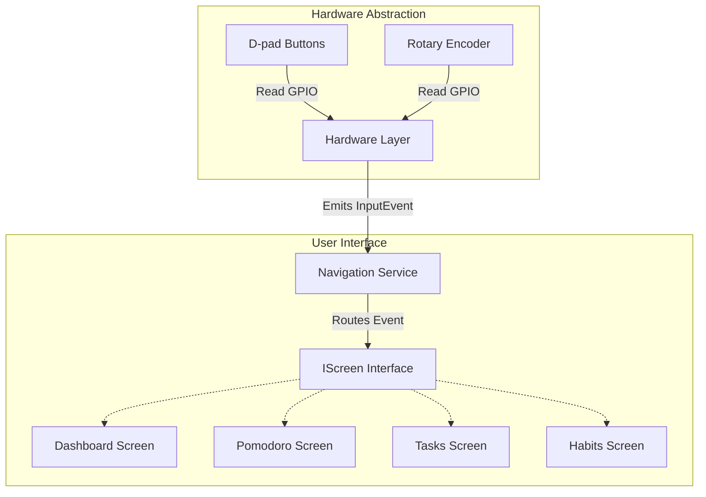
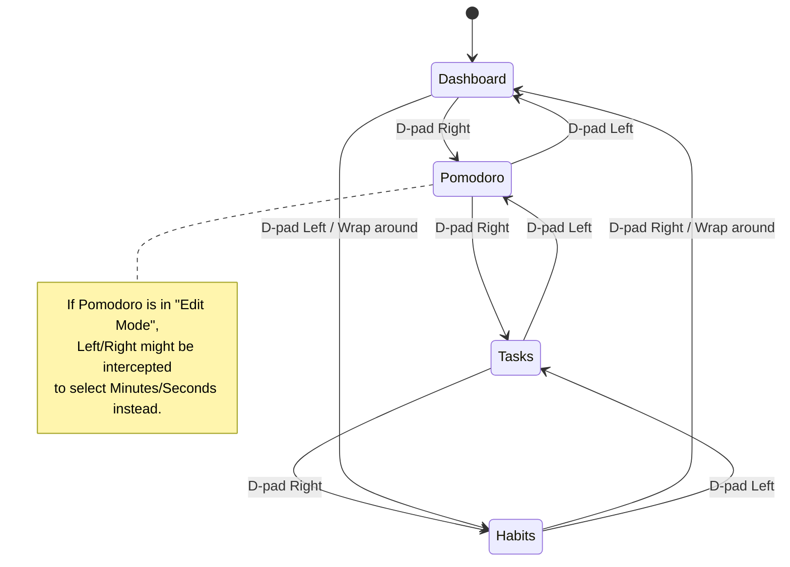
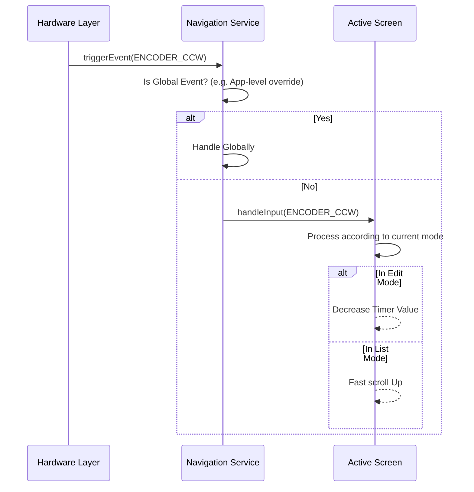

# Navigation Architecture & Implementation Guide

## Overview

The DeskBuddy device uses a combination of a 4-way D-pad (Up, Down, Left, Right) and a Rotary Encoder (Rotation CW/CCW, Push) for user input. To ensure a predictable and uniform user experience across different screens, we use a centralized **NavigationService** (acting as a Navigation Manager/State Machine) to decouple hardware events from UI logic.

### Design Philosophy

- **D-pad Left/Right**: Global navigation to switch between main application screens (Dashboard, Pomodoro, Tasks, Habits).
- **D-pad Up/Down**: Local navigation to move focus vertically between items in a list or widgets on the current screen.
- **Encoder Rotation**: Fine adjustment. Used for scrubbing through lists rapidly or altering values (like minutes in Pomodoro) when in "Edit Mode".
- **Encoder Push**: The primary "Confirm" or action button. It selects items, toggles edit modes, or marks tasks as complete.

---

## 1. System Architecture

The architecture relies on a unidirectional event flow. Hardware drivers emit logical events, the Navigation Service routes them, and the active Screen reacts according to its specific context.



---

## 2. Navigation State Machine

Left and Right D-pad events are typically intercepted by the Navigation Service itself to switch the active screen, unless the current screen is in a strict "Edit Mode" (where it might block global navigation).



---

## 3. Event Handling Flow

When a user interacts with the device, the following flow occurs to resolve the action:



---

## 4. Implementation Guide

To implement this architecture in C++, follow this blueprint:

### Step 4.1: Define the Input Events

Create an enum that maps all possible logical interactions. This detaches the UI from physical GPIO pins.

```cpp
enum class InputEvent {
    DPAD_UP,
    DPAD_DOWN,
    DPAD_LEFT,
    DPAD_RIGHT,
    ENCODER_CW,
    ENCODER_CCW,
    ENCODER_PRESS,
    ENCODER_LONG_PRESS
};
```

### Step 4.2: Define the Screen Interface (`IScreen.h`)

Every screen must implement a common interface so the Navigation Service can universally manage them.

```cpp
class IScreen {
public:
    virtual ~IScreen() = default;

    // Called when the screen comes into focus
    virtual void onEnter() = 0;

    // Called when navigating away from the screen
    virtual void onExit() = 0;

    // Core event handler. Returns 'true' if the screen consumed the event,
    // 'false' if it ignored it (allowing Navigation Service to handle it globally).
    virtual bool handleInput(InputEvent event) = 0;

    // Standard rendering loop
    virtual void loop() = 0;
};
```

### Step 4.3: Implement the Navigation Service (`NavigationService.h`)

The service holds a pointer to the active screen and provides an API for hardware interrupts/polling to inject events.

```cpp
class NavigationService {
private:
    IScreen* activeScreen;
    // Potentially an array or linked list of screens for left/right switching

public:
    void injectEvent(InputEvent event) {
        // If the active screen handles it, we are done
        if (activeScreen && activeScreen->handleInput(event)) {
            return;
        }

        // Fallback: Global Navigation Logic
        if (event == InputEvent::DPAD_RIGHT) {
            switchToNextScreen();
        } else if (event == InputEvent::DPAD_LEFT) {
            switchToPreviousScreen();
        }
    }

    void switchToScreen(IScreen* newScreen) {
        if (activeScreen) activeScreen->onExit();
        activeScreen = newScreen;
        if (activeScreen) activeScreen->onEnter();
    }
};
```

### Step 4.4: Screen-Specific Implementations

When building a screen (e.g., `PomodoroScreen`), maintain a local state mode (e.g., `enum State { VIEW, EDIT_TIME }`) to decide how events are interpreted inside `handleInput()`.

- **VIEW State**: `ENCODER_PRESS` sets state to `EDIT_TIME`.
- **EDIT_TIME State**: `ENCODER_CW/CCW` modifies text/values. `ENCODER_PRESS` saves and switches back to `VIEW` state. All `DPAD_LEFT/RIGHT` events drop out (return false) or move to the next editable field.

This provides a rock-solid, decoupled structure to incrementally build out the UI.
